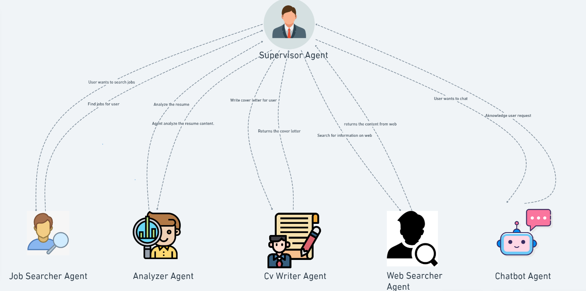

# 🚀 CareerMind AI - Multi-Agent GenAI Career Assistant



[](https://www.python.org/downloads/)
[](https://streamlit.io/)
[](https://langchain.com/)
[](LICENSE)

**Intelligent Career Assistant powered by Multi-Agent AI Architecture**

## 👨‍💻 Creator

**Omar Francisco Arellano Ganem** - Principal Cloud AI Data Scientist  
📊 **44+ AI Projects** delivered across industries  
🔗 [LinkedIn](https://www.linkedin.com/in/omar-francisco-arellano-ganem/)

## 🎯 What It Does

CareerMind AI is a multi-agent system that revolutionizes job searching and career development:

- **🔍 Smart Job Search** - Find relevant jobs with AI-powered matching
- **📊 Resume Analysis** - ATS optimization and skill extraction  
- **✍️ Cover Letter Generation** - Personalized letters for each application
- **🌐 Company Research** - Deep insights about potential employers
- **📈 Market Intelligence** - Salary trends and industry analysis
- **🎯 Career Planning** - Strategic roadmaps and skill development

## 🏗️ Multi-Agent Architecture

```
🎯 Supervisor Agent (Router)
├── 🔍 JobSearcher Agent
├── 📊 ResumeAnalyzer Agent  
├── ✍️ CoverLetterGenerator Agent
├── 🌐 WebResearcher Agent
├── 🎯 CareerAdvisor Agent
├── 📈 MarketAnalyst Agent
└── 🤖 ChatBot Agent
```

## 🛠️ Tech Stack

- **AI Framework**: LangChain, LangGraph
- **LLM Providers**: OpenAI GPT-4, Groq (Llama)
- **Web Interface**: Streamlit
- **Search APIs**: Serper (Google), FireCrawl
- **Job Platforms**: LinkedIn API integration

## 📁 Project Structure

```
├── agents.py              # Multi-agent orchestration
├── app.py                 # Streamlit web app
├── chains.py              # LangChain routing logic
├── tools.py               # Agent-specific tools
├── search.py              # Job search functionality
├── prompts.py             # AI prompt templates
├── schemas.py             # Data validation models
├── utils.py               # Utility functions
├── data_loader.py         # Document processing
├── llms.py                # LLM configuration
├── members.py             # Agent definitions
└── custom_callback_handler.py # UI callbacks
```

## 🚀 Quick Start

### 1. Installation

```bash
git clone https://github.com/peak-omar/CareerMind-AI-Multi-Agent-GenAI-Career-Assistant-applicaiton.git
cd CareerMind-AI-Multi-Agent-GenAI-Career-Assistant Application
pip install -r requirements.txt
```

### 2. Environment Setup

Create `.streamlit/secrets.toml`:

```toml
OPENAI_API_KEY = "sk-your-openai-api-key"
GROQ_API_KEY = "gsk_your-groq-api-key"
SERPER_API_KEY = "your-serper-api-key"
FIRECRAWL_API_KEY = "your-firecrawl-api-key"

# Optional LinkedIn Integration
LINKEDIN_EMAIL = "your-email@domain.com"
LINKEDIN_PASS = "your-password"
LINKEDIN_SEARCH = "linkedin_api"

# LangSmith Tracing (Optional)
LANGCHAIN_API_KEY = "your-langsmith-key"
LANGCHAIN_TRACING_V2 = "true"
LANGCHAIN_PROJECT = "CareerMind-AI"
```

### 3. Run Application

```bash
streamlit run app.py
```

## 💡 How to Use

1. **Upload Resume** - Upload your PDF resume for analysis
2. **Choose Action** - Select from quick action pills or type custom queries
3. **Get Results** - Receive AI-powered insights and recommendations
4. **Download Files** - Save generated cover letters and reports

### Example Queries

- "Find software engineer jobs in San Francisco"
- "Analyze my resume for data science roles"
- "Generate cover letter for Google product manager position"
- "Research Apple company culture and recent news"
- "What are current salary trends for developers?"

## ⚙️ Key Features

### 🔍 Job Search Engine
- Multi-platform job discovery (LinkedIn, Indeed, Glassdoor)
- Advanced filtering (location, experience, salary, remote)
- AI-powered relevance scoring

### 📊 Resume Analyzer
- ATS compatibility checking
- Skills extraction and categorization
- Market positioning analysis
- Improvement recommendations

### ✍️ Cover Letter Generator
- Company-specific personalization
- Multiple professional templates
- ATS optimization
- Direct download in DOCX format

### 🌐 Web Research
- Company background research
- Industry trend analysis
- News and recent developments
- Competitive intelligence

### 📈 Market Analysis
- Real-time salary benchmarking
- Industry growth insights
- Skills demand forecasting
- Career progression analysis

## 🔧 API Keys Setup

| Service | Purpose | Required |
|---------|---------|----------|
| OpenAI | Core LLM functionality | ✅ Yes |
| Groq | Fast LLM alternative | ⚡ Recommended |
| Serper | Web search capabilities | ✅ Yes |
| FireCrawl | Web scraping | ✅ Yes |
| LinkedIn | Job search integration | 🔧 Optional |

## 📊 Performance

- **Response Time**: < 3 seconds for most queries
- **Job Search**: Up to 50 relevant positions per search
- **Resume Analysis**: Comprehensive 360° evaluation
- **Cover Letters**: ATS-optimized, personalized content
- **Multi-Model Support**: OpenAI, Groq, Anthropic compatibility

## 🤝 Contributing

1. Fork the repository
2. Create feature branch (`git checkout -b feature/AmazingFeature`)
3. Commit changes (`git commit -m 'Add AmazingFeature'`)
4. Push to branch (`git push origin feature/AmazingFeature`)
5. Open Pull Request

## 📄 License

This project is licensed under the MIT License - see the [LICENSE](LICENSE) file for details.

## ⭐ Show Your Support

If this project helped you, please give it a ⭐ star!


<div align="center">
  <em>Revolutionizing careers through AI innovation</em>
</div>
